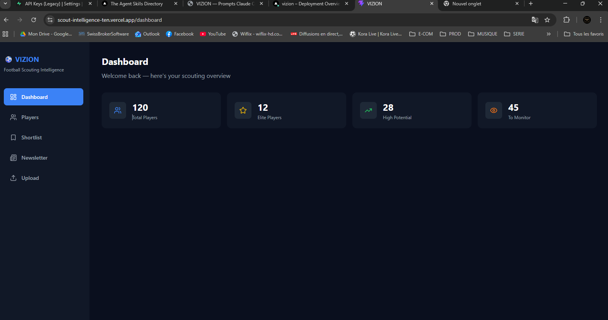

# VIZION — Football Scouting Intelligence


A modern scouting platform for football analysts and recruitment departments. VIZION centralises player data, automates scout scoring, and surfaces actionable insights — so your staff spends less time in spreadsheets and more time on the pitch.

---

## Screenshot

<!-- Add a screenshot of the app here -->


---

## Features

- **Player database** — filterable table with position, team, competition, and scout score
- **Scout scoring engine** — automated ELITE / TOP PROSPECT / INTERESTING / TO MONITOR / LOW PRIORITY labels
- **Personal shortlists** — each scout manages their own watchlist independently
- **Dashboard overview** — at-a-glance stats on pool composition and label distribution
- **CSV export** — one-click export of shortlists for reporting
- **Secure by default** — Row Level Security on all Supabase tables, `.env`-based config

---

## Tech Stack

| Layer | Technology |
|---|---|
| Frontend | React 19 + TypeScript |
| Build | Vite 8 |
| Styling | Tailwind CSS 3 |
| Routing | React Router v7 |
| Data fetching | TanStack Query v5 |
| Charts | Recharts |
| Backend / DB | Supabase (PostgreSQL + Auth + RLS) |
| Deployment | Vercel |

---

## Getting Started

### Prerequisites

- Node.js 18+
- A [Supabase](https://supabase.com) project with the `players` table created

### Installation

```bash
# 1. Clone the repository
git clone https://github.com/karimkomi536-dev/scout-intelligence.git
cd scout-intelligence

# 2. Install dependencies
npm install

# 3. Configure environment variables
cp .env.example .env
# Edit .env and fill in your Supabase credentials

# 4. Start the development server
npm run dev
```

The app will be available at `http://localhost:5173`.

### Environment Variables

| Variable | Description |
|---|---|
| `VITE_SUPABASE_URL` | Your Supabase project URL |
| `VITE_SUPABASE_ANON_KEY` | Public anon key (safe for the browser) |
| `VITE_SUPABASE_SERVICE_ROLE_KEY` | Service role key — **never expose client-side** |

See [`.env.example`](.env.example) for the full template.

---

## Live App

[scout-intelligence-ten.vercel.app](https://vizion.vercel.app) *(link to be updated)*

---

## Roadmap

- [ ] **Authentication** — scout accounts with role-based access (scout / head of recruitment / admin)
- [ ] **Player profiles** — dedicated page with full stats, match history, and scouting notes
- [ ] **Upload pipeline** — bulk import via CSV or StatsBomb / Wyscout API integration
- [ ] **AI scouting reports** — automated report generation from raw match data

---

## License

MIT © 2026 Karim
